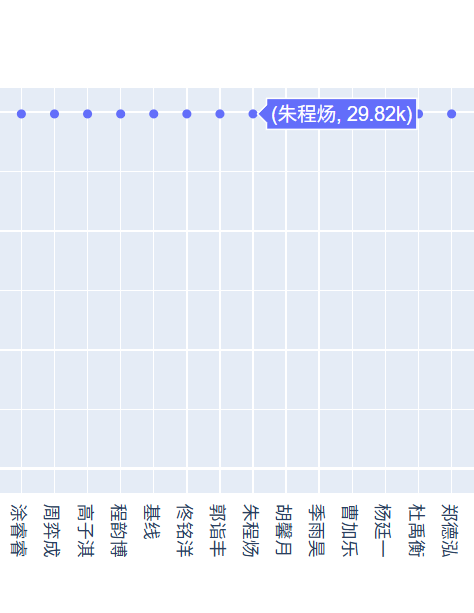
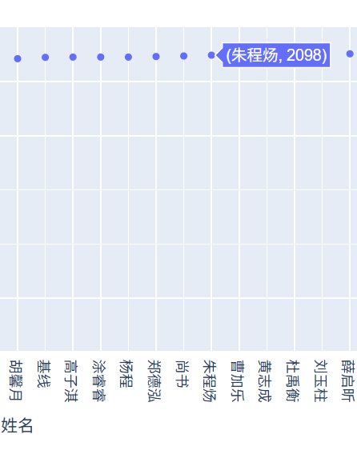

# Algorithm DNA Lab2


| Title      | Student Name    | Student ID  | Date     |
| --------- | --------------- | ----------- | -------- |
| Algorithm | Zecyel (朱程炀) | 23300240014 | 2025.5.31 |


## 1. 实验要求&运行结果

给出 DNA 匹配的评分代码，要求构建匹配序列，使得评分超过基线。





## 2. 代码实现

```rust
use edlib_rs::edlibrs::*;
use std::fs::File;
use std::io::Read;

fn reverse_in_place(s: &mut String) {
    let mut chars: Vec<char> = s.chars().collect();
    chars.reverse();
    s.clear();
    s.extend(chars);
}

fn replace_dna_bases(input: &str) -> String {
    input
        .chars()
        .map(|c| match c {
            'A' => 'T',
            'T' => 'A',
            'G' => 'C',
            'C' => 'G',
            _ => c,
        })
        .collect()
}

fn merge_intervals(intervals: &mut Vec<(usize, usize)>) -> (usize, usize) {
    if intervals.is_empty() {
        return (0, 0);
    }

    intervals.sort_by(|a, b| a.0.cmp(&b.0).then(a.1.cmp(&b.1)));

    let mut merged = vec![];
    let mut largest_interval = (0, 0);

    let mut current = intervals[0];

    for &(start, end) in intervals.iter().skip(1) {
        if start <= current.1 {
            current.1 = current.1.max(end);
        } else {
            merged.push(current);
            if current.1 - current.0 > largest_interval.1 - largest_interval.0 {
                largest_interval = current;
            }
            current = (start, end);
        }
    }

    merged.push(current);
    if current.1 - current.0 > largest_interval.1 - largest_interval.0 {
        largest_interval = current;
    }

    largest_interval
}

fn paged_comparison(
    query_seq: &str,
    reference_seq_rc: &str,
    page_size: usize,
    threshold: i32,
) -> (
    Vec<(usize, usize)>,
    Vec<(usize, usize)>,
    (usize, usize),
    (usize, usize),
) {
    let len_ref = reference_seq_rc.len();
    let len_query = query_seq.len();

    let num_of_pages_ref = len_query.max(len_ref) / page_size + 1;
    let num_of_pages_query = len_query.max(len_query) / page_size + 1;

    let mut intervals_query = Vec::new();
    let mut intervals_ref = Vec::new();

    for i in 0..num_of_pages_query {
        let query = &query_seq[i * page_size..((i + 1) * page_size).min(len_query)];
        for j in 0..num_of_pages_ref {
            let target = &reference_seq_rc[j * page_size..((j + 1) * page_size).min(len_ref)];

            let align_res = edlibAlignRs(
                query.as_bytes(),
                target.as_bytes(),
                &EdlibAlignConfigRs::default(),
            );

            if align_res.editDistance < threshold {
                intervals_query.push((i * page_size, ((i + 1) * page_size).min(len_query)));
                intervals_ref.push((j * page_size, ((j + 1) * page_size).min(len_ref)));
            }
        }
    }

    let merged_interval_query = merge_intervals(&mut intervals_query);
    let merged_interval_ref = merge_intervals(&mut intervals_ref);

    (
        intervals_query,
        intervals_ref,
        merged_interval_query,
        merged_interval_ref,
    )
}

fn main() {
    let mut refer_file = File::open("data/reference.txt").unwrap();
    let mut refer_sequence = String::new();
    refer_file.read_to_string(&mut refer_sequence).unwrap();
    reverse_in_place(&mut refer_sequence);
    let reference_seq_rc = replace_dna_bases(&refer_sequence);

    let mut query_file = File::open("data/query.txt").unwrap();
    let mut query_seq = String::new();
    query_file.read_to_string(&mut query_seq).unwrap();

    let (_, __, merged_interval_query_1, merged_interval_ref_1) =
        paged_comparison(&query_seq, &reference_seq_rc, 128, 10);

    let query_result = merged_interval_query_1;
    let ref_result = (
        reference_seq_rc.len() - merged_interval_ref_1.1,
        reference_seq_rc.len() - merged_interval_ref_1.0
    );
    println!("({}, {}, {}, {})", query_result.0, query_result.1, ref_result.0, ref_result.1);
}
```

## 3. 实现思路

我们在提出了一种多尺度序列模糊匹配的方法。考虑到DNA序列难以严格匹配，我们将其划分为不同尺度的子区间，通过合理的参数设置确定子区间配对的阈值。例如，代码中的默认实现的子区间长度是 30，低于 30 的字串不做匹配，若两个子区间间的剪切距离小于 10%，则视为可以配对。由于基于子区间的模糊匹配方法常常因为子区间粒度过大，导致序列边缘的匹配效果较差，因此我们的方法支持不同的尺度。

## 4. 算法复杂度分析

一般而言，我们的多尺度序列模糊匹配工作流中包含多个串行的匹配，在总复杂度中只影响常数项，因此我们只分析一次匹配的复杂度。令参考序列 ref 长度为 n，样本序列 query 长度为 m，子区间长度为 l。

1. 获得参考序列 ref 的反向互补链 rc，时间复杂度 O(n)，空间复杂度 O(n)。

2. 以子区间为单位，计算 query 与 ref 中各子区间之间的剪切距离。时间复杂度 $O(\frac{nm}{l^2} \times l^2) = O(nm)$，其中求子区间剪切距离的时间复杂度为 $O(l \times l)=O(1)$。空间复杂度为 $O(\frac{nm}{l^2}) = O(nm)$，及子区间剪切距离矩阵。

3. 遍历子区间剪切距离矩阵，获得剪切距离处于阈值下的子区间对，并合并输出，时间复杂度为 $O(\frac{nm}{l^2}) = O(nm)$，空间复杂度为常数。

综上，一次最大匹配算法的时间复杂度为 $O(nm)$，空间复杂度为 $O(nm)$。

再匹配了这一部分字符串之后，将其匹配上的部分全部设置成 U，之后再找最大串匹配，直到失配率大于 10% 则停止。在样本 1 中会匹配 4 次，样本 2 中会匹配 17 次。可以将其视作常数，因此总的算法的时间复杂度是 $O(nm)$，空间复杂度为 $O(nm)$。

如果想要得到更高的分数，可以使用 search.py 对匹配边界进行微调。但是不微调也已经能够超过基线。因此不在此分析这部分的时间复杂度。（实际的时间复杂度是 $O(9^k\cdot nm)$，其中 k 是匹配的段数，可以视作常数。但是其常数太大。最终使用了计算机学院的昇腾 910b 超算进行了并行计算，得到目标结果）
